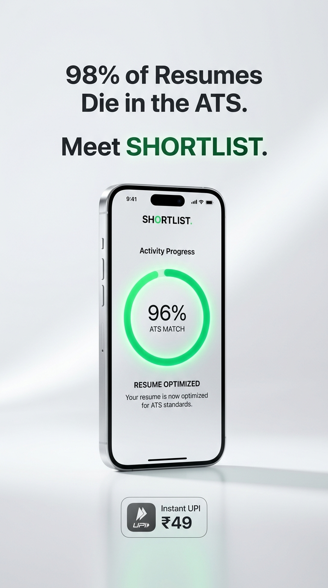

# SHORTLIST 

<div align="center">

[](https://craftats-ai.vercel.app)
[](https://nextjs.org/)
[](https://tailwindcss.com/)
[](./LICENSE)

**Precision ATS Resume Optimization & Executive Bullet Re-Writer Micro-SaaS**

*Every job opening gets 250+ resumes. Only 5 get shortlisted. Shortlist audits your resume against target ATS algorithms and upgrades your metrics to guarantee recruiter visibility.*

[**Explore Live Website**](https://craftats-ai.vercel.app) • [**Report Bug**](https://github.com/darsheelsirola-bit/shortlist-pro/issues) • [**Request Feature**](https://github.com/darsheelsirola-bit/shortlist-pro/issues)

<br/>



</div>

---

## ✨ Features

###  1. Apple Official Design Aesthetic
- **Porcelain Canvas (`#f5f5f7`)**: Official Apple light background with natural tactile contrast.
- **VisionOS Translucent Glass**: Multi-layered `.liquid-glass` cards featuring `backdrop-filter: blur(32px) saturate(190%)` and micro-beveled borders.
- **Razor-Sharp Typography**: Global font stack prioritizing **Inter** (300 to 900), **Plus Jakarta Sans**, and Apple San Francisco fallbacks with `-webkit-font-smoothing: antialiased` and optical tracking.
- **Ambient Chromatic Light Orbs**: Floating fluid gradients behind translucent cards that refract gently on scroll.
- **Apple Health Activity Gauge**: Interactive circular gauge visualizing real-time ATS match scoring from 0% to 100%.

### 🎯 2. Deterministic ATS Optimization Engine
- **Exact Keyword Gap Analysis**: Scans input job descriptions for hard skills, technical competencies, and domain keywords; calculates true mathematical match ratios.
- **Google X-Y-Z Bullet Re-Writer**: Transforms passive bullets into high-impact accomplishments using Google's formula: *"Accomplished [X], as measured by [Y], by doing [Z]"*.
- **Interactive Before & After Diff**: Side-by-side comparison tab highlighting upgraded metrics and quantified impact.
- **Click-to-Insert Keyword Badges**: Single-tap insertion of missing skills directly into the resume draft.
- **1-Click Plain-Text Export**: Generates and downloads a clean, ATS-safe `.txt` resume that parses without formatting errors on Workday, Greenhouse, Taleo, and Lever.

### ⚡ 3. Direct UPI Payments (Zero Commission)
- **Direct VPA-to-VPA Transfer**: 100% of customer payments land directly in the owner's bank account via UPI ID: **`darsheel.sirola@fam`**.
- **0% Gateway Deductions**: Eliminates intermediary 2–3% transaction fees and complex merchant onboarding KYC hurdles.
- **Dynamic Scannable QR Code**: Generates instant QR codes pre-encoded with the selected amount and receiving VPA.
- **1-Tap Mobile Deep Link**: Supports instant checkout in Google Pay, PhonePe, Paytm, BHIM, and Cred.
- **12-Digit UTR Verification**: Instant credit activation upon entering the transaction reference number.
- **Ultra-Affordable INR Micro-Pricing**:
  - **₹49** one-time: 15 full ATS Audits (~₹3.20/audit)
  - **₹99 / month**: Unlimited Pro access

### 🛡️ 4. Comprehensive Legal Shield
- **[Terms of Service](./app/terms/page.tsx)**:
  - Capped maximum liability strictly at ₹99.00 INR.
  - Explicit "No Employment Guarantee" disclaimer protecting against hiring outcome claims.
  - Mandatory individual binding arbitration.
  - Trademark fair-use disclaimers for mentioned ATS platforms (Workday, Taleo, Greenhouse, etc.).
- **[Privacy Policy](./app/privacy/page.tsx)**:
  - Ephemeral data processing disclosures with strict "No Data Selling" pledge.

### 🎬 5. Interactive Video Advertising Studio (`/promo`)
- In-app 9:16 vertical Reel/Short and 16:9 landscape motion graphics video generator.
- Native browser `MediaRecorder` + HTML5 Canvas video export (`.webm`) at 1080x1920.
- Web Audio API synthesizer generating real-time cinematic bass booms, chimes, and radar sound effects.
- Browser `SpeechSynthesis` voiceover synchronization.
- 1-click viral Instagram, YouTube Shorts, and LinkedIn marketing copy kits.

---

## 📁 Repository Structure

```text
shortlist-pro/
├── .github/
│   └── workflows/
│       └── ci.yml             # GitHub Actions CI build & type-check
├── app/
│   ├── api/
│   │   ├── checkout/
│   │   │   └── route.ts       # Stripe fallback checkout route
│   │   └── tailor/
│   │       └── route.ts       # Deterministic ATS keyword analyzer & re-writer
│   ├── app/
│   │   └── page.tsx           # Dedicated Executive ATS Workstation & UPI modal
│   ├── login/
│   │   └── page.tsx           # Apple-style Sign In with 1-click Demo access
│   ├── signup/
│   │   └── page.tsx           # Apple-style Account Registration (+5 Free Credits)
│   ├── privacy/
│   │   └── page.tsx           # Privacy Policy with ephemeral processing disclosures
│   ├── promo/
│   │   └── page.tsx           # Interactive 9:16 & 16:9 Ad Studio & Video Generator
│   ├── terms/
│   │   └── page.tsx           # Terms of Service & legal liability shield
│   ├── globals.css            # VisionOS liquid glass, Apple styling & typography
│   ├── layout.tsx             # Root layout, Google Fonts (Inter), AuthProvider
│   └── page.tsx               # Dedicated Apple-style Product Landing Page
├── components/
│   ├── AuthContext.tsx        # Persistent client session & credits state
│   └── Logo.tsx               # Scalable Apple-style SVG monogram logo
├── public/
│   └── shortlist_ad_poster.jpg # 9:16 vertical advertisement artwork
├── .env.example               # Environment variables template
├── .gitignore                 # Next.js & Node.js ignore rules
├── LICENSE                    # MIT License
├── next.config.mjs            # Next.js build configuration
├── package.json               # Dependencies & project scripts
├── postcss.config.js          # PostCSS configuration
├── tailwind.config.js         # Tailwind theme, keyframes & font settings
└── tsconfig.json              # TypeScript configuration
```

---

## 🚀 Getting Started Locally

### Prerequisites
- **Node.js**: v18.17.0 or newer (tested on Node.js v20 and v24)
- **npm**: v9 or newer

### Installation

1. **Clone the repository:**
   ```bash
   git clone https://github.com/darsheelsirola-bit/shortlist-pro.git
   cd shortlist-pro
   ```

2. **Install dependencies:**
   ```bash
   npm install
   ```

3. **Configure environment variables:**
   ```bash
   cp .env.example .env.local
   ```
   *(Optional: Set your own `NEXT_PUBLIC_MERCHANT_UPI_ID` if changing the receiving UPI address).*

4. **Start the development server:**
   ```bash
   npm run dev
   ```

5. **Open in browser:**
   Navigate to [http://localhost:3000](http://localhost:3000).

---

## 🌐 Production Deployment (Vercel)

This application is built with Next.js App Router and deploys to **Vercel** with zero configuration:

1. Push your changes to the `main` branch:
   ```bash
   git push origin main
   ```
2. Connect your repository on [vercel.com](https://vercel.com/new).
3. Add the production environment variable:
   - `NEXT_PUBLIC_MERCHANT_UPI_ID`: `darsheel.sirola@fam`
4. Deploy! Your site will be live globally with automatic SSL.

---

## 📜 License

Distributed under the **MIT License**. See [`LICENSE`](./LICENSE) for more information.

---

<div align="center">
  <sub>Designed for candidate excellence. Built with precision for <strong>SHORTLIST</strong>.</sub>
</div>
